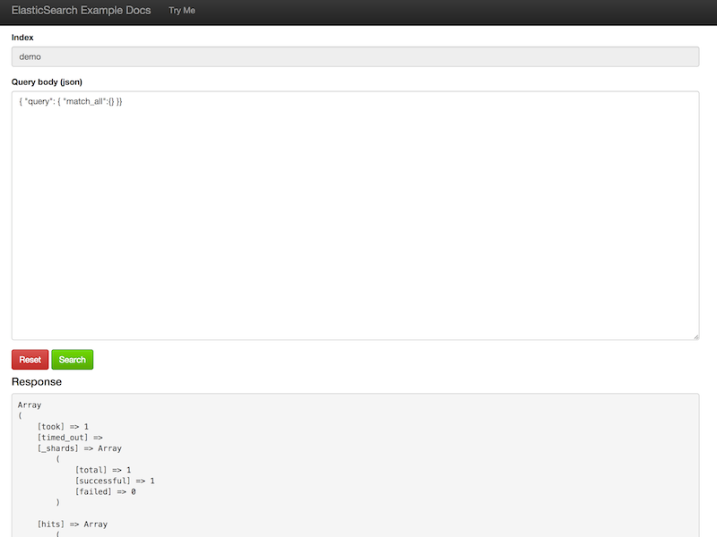
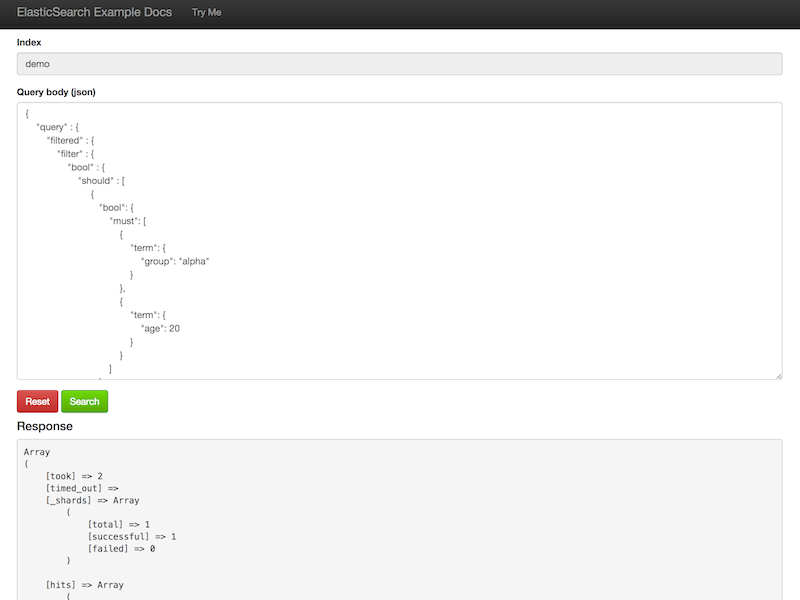
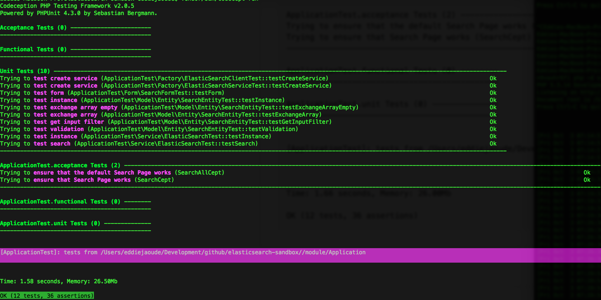
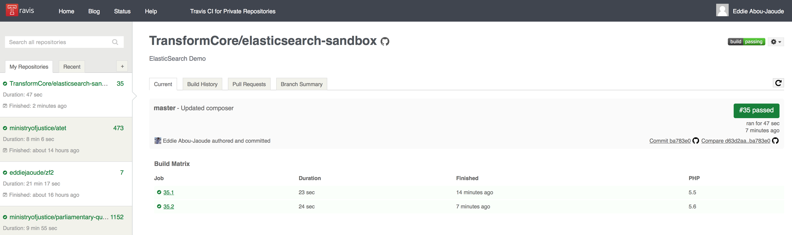
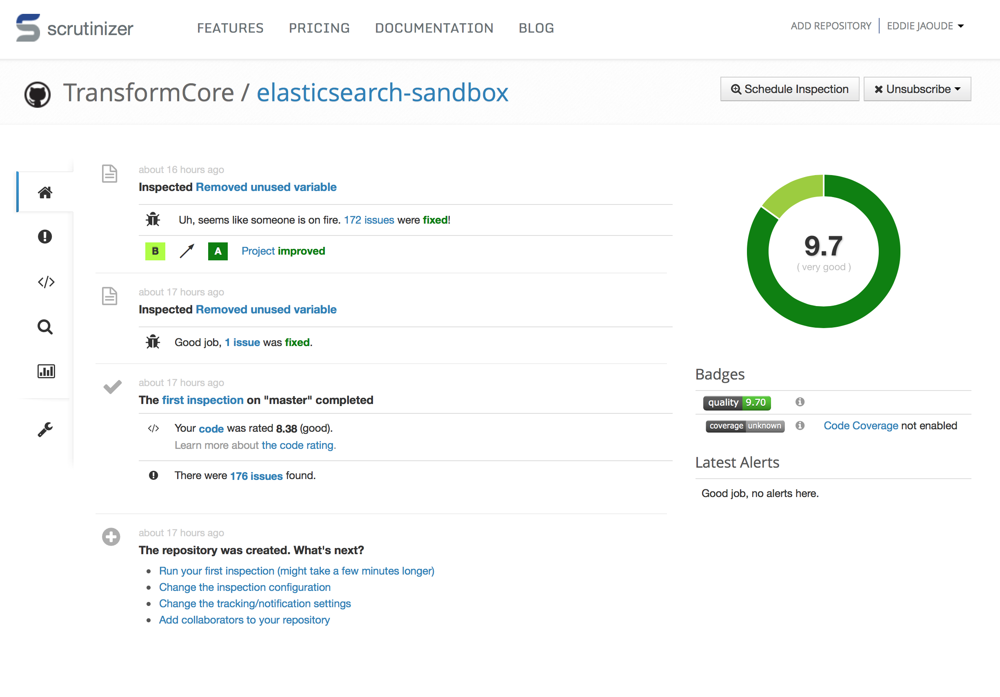

[](https://travis-ci.org/TransformCore/elasticsearch-sandbox) 
[](https://scrutinizer-ci.com/g/TransformCore/elasticsearch-sandbox/?branch=master)
[](https://scrutinizer-ci.com/g/TransformCore/elasticsearch-sandbox/?branch=master)

composer.lock [](https://www.versioneye.com/user/projects/542e331ebeeeeefccb000138)

composer.json [](https://www.versioneye.com/user/projects/542e3319beeeee2af1000093)

# ElasticSearch Demo

**Note: This Application sleeps when not in use, therefore the first request after sleeping will be slower while it boots.**

URL: http://elasticsearch-sandbox.herokuapp.com/

This Demo allows one to run the Search Examples from https://github.com/TransformCore/elasticsearch-example-docs

## Screenshots




## How to run a private instance of the Application

### Development

1. Clone project (Fork if wish to contribute back)
`git clone https://github.com/eddiejaoude/elasticsearch-sandbox.git`

2. Run composer
`php composer.phar install`

2. Run PHP Built-in Webserver
`ES_URL={ELASTIC-SEARCH-URL} ES_USERNAME={ELASTIC-SEARCH-USERNAME} ES_PASSWORD={ELASTIC-SEARCH-PASSWORD} php -d variables_order=EGPCS -S 0.0.0.0:8000 -t public/`

3. Load dummy data
`ES_URL={ELASTIC-SEARCH-URL} ES_USERNAME={ELASTIC-SEARCH-USERNAME} ES_PASSWORD={ELASTIC-SEARCH-PASSWORD} php public/index.php load data demo`

4. Then go to that port in your browser http://localhost:8000 & start playing

Note: Instead of putting the ENV variables infront of the comands, you can either set them as ENV variables in your system or the simplest method is to copy `elasticsearch.local.php.dist` to a file called `elasticsearch.local.php` and replace the variables.

Example Searches with **Dummy Data** https://github.com/TransformCore/elasticsearch-example-docs

### How to run Test Suite

`vendor/bin/codecept run`

or with Code Coverage

`vendor/bin/codecept run --coverage --coverage-xml`

Output:
```
vendor/bin/codecept run
Codeception PHP Testing Framework v2.0.5
Powered by PHPUnit 4.2.6 by Sebastian Bergmann.

Acceptance Tests (0) ------------------------
---------------------------------------------

Functional Tests (0) ------------------------
---------------------------------------------

Unit Tests (10) ---------------------------------------------------------------------------------------------------------------------------------------
Trying to test create service (ApplicationTest\Factory\ElasticSearchClientTest::testCreateService)                                                Ok
Trying to test create service (ApplicationTest\Factory\ElasticSearchServiceTest::testCreateService)                                               Ok
Trying to test form (ApplicationTest\Form\SearchFormTest::testForm)                                                                               Ok
Trying to test instance (ApplicationTest\Model\Entity\SearchEntityTest::testInstance)                                                             Ok
Trying to test exchange array empty (ApplicationTest\Model\Entity\SearchEntityTest::testExchangeArrayEmpty)                                       Ok
Trying to test exchange array (ApplicationTest\Model\Entity\SearchEntityTest::testExchangeArray)                                                  Ok
Trying to test get input filter (ApplicationTest\Model\Entity\SearchEntityTest::testGetInputFilter)                                               Ok
Trying to test validation (ApplicationTest\Model\Entity\SearchEntityTest::testValidation)                                                         Ok
Trying to test instance (ApplicationTest\Service\ElasticSearchTest::testInstance)                                                                 Ok
Trying to test search (ApplicationTest\Service\ElasticSearchTest::testSearch)                                                                     Ok
-------------------------------------------------------------------------------------------------------------------------------------------------------

ApplicationTest.acceptance Tests (2) ----------------------------------------------------------------------------------------------------------------------------------------------
Trying to ensure that the default Search Page works (SearchAllCept)                                                                                                           Ok
Trying to ensure that Search Page works (SearchCept)                                                                                                                          Ok
-----------------------------------------------------------------------------------------------------------------------------------------------------------------------------------

ApplicationTest.functional Tests (0) --------
---------------------------------------------

ApplicationTest.unit Tests (0) --------------
---------------------------------------------


[ApplicationTest]: tests from /Users/eddiejaoude/Development/github/elasticsearch-sandbox/module/Application

Time: 1.66 seconds, Memory: 26.00Mb

OK (12 tests, 36 assertions)
```

### Codeception Test Results Screenshot



## Screenshots

Travis CI



Scrutinizer Static Code Analysis


